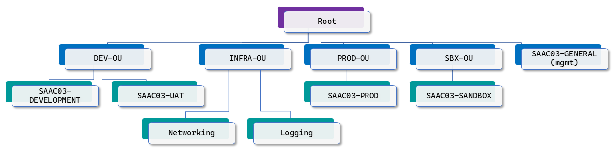
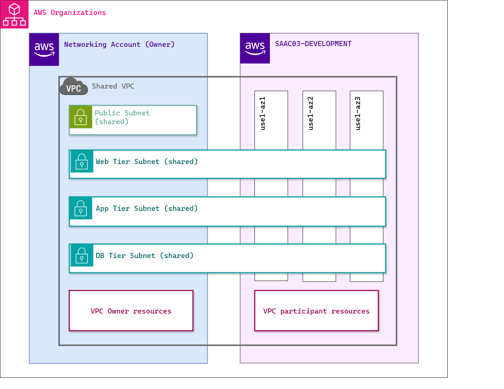

## Context

An **AWS Three Tier Web Architecture** project *loosely* based on the sample project here. https://github.com/harishnshetty/3-tier-aws-15-services

I say *loosely* because the application portion of the project has been used from that project, since I do not come from that background. I will also be using a similar infra around the application but using ideas that come from my own experience in the last couple of years.

**Note:** The original project is quite simple and straight forward which is meant to introduce some AWS services to beginners. In my attempt, I will be adding more complexity than is required, so that it can reflect some of the architectural designs and decisions I've experienced in my career.

## AWS Account Organization structure

This is the AWS Org structure I have set up in my personal account and will be planning to use the same to deploy this project.

- The VPCs and Subnets will be deployed in the `Networking` account, along with other network constructs and will be shared with other accounts, utilizing [VPC sharing](https://docs.aws.amazon.com/vpc/latest/userguide/vpc-sharing.html).
- VPC Flowlogs and other logs will be saved in a centralized `Logging` account in the `Infra` OU.
- The subnets will initially be shared with `SAAC03-DEVELOPMENT` while the developers work on and refine the application.

## Infrastructure architecture

- There will be 3 shared subnets deployed in az1, az2 and az3 in the Networking account that will be shared with the other accounts.
- Each account will identify the AZs that related to the AZ-IDs az1, az2 and az3 in their own accounts to identify the right subnet and deploy resources.
- Some common resources that can be created in the shared VPC and managed by the Networking account such as S3 buckets for logging, Route53, NAT Gateways etc will be deployed in the Networking account.
- Other resources that will be be created in the Accounts with which the subnets are shared (*participating accounts*) will be created in those accounts.
- Some resources that can not be directly created by participating accounts in the shared subnets may still be accessible through Privatelink and we'll do that if required.

## Application architecture

- All three tiers will be deployed in private subnets and the front end web application will be exposed to the internet via the NAT Gateway.
