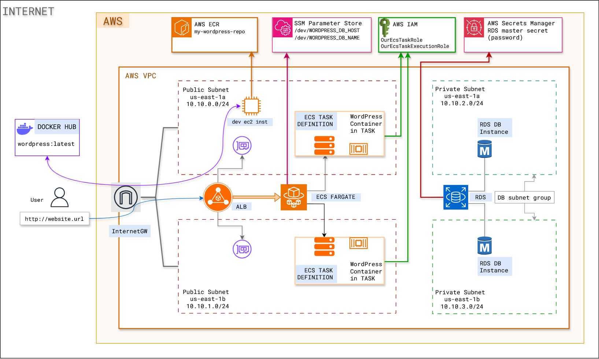

# ABOUT — Wordpress on AWS ECS (Fargate) + RDS (MySQL), built CLI-first

This folder is my “Docker Compose → AWS” learning lab.

When most of us learn Docker, we eventually run the classic WordPress + database setup:
- a database container (MariaDB/MySQL)
- a WordPress container
- a couple of environment variables so WordPress knows where the database is

This project takes that idea and recreates it on AWS:
- **ECS Fargate** runs the WordPress container (no EC2 instances to manage)
- **RDS** runs the MySQL database (managed, patching handled by AWS)
- **ALB** (Application Load Balancer) sends HTTP traffic to the WordPress container
- **Secrets Manager** stores the database password (managed by RDS)
- **ECR** hosts the WordPress image
- **SSM Parameter Store** stores a couple of “connect to DB” values

## The Architecture diagram looks like this:

<kbd>  </kbd>

The personal constraint I’m trying to keep throughout the project is:

> Do as much as possible via AWS CLI. If I can’t, I’ll fall back to the console.

I also use a temporary CLI profile called `wpprofile` so I don’t accidentally run these commands in the wrong account.

---

## What we’re building (the end state)
Please note that this is not the "ideal" production setup for WordPress on AWS. This is a learning lab, so I kept things as simple as possible while still following best practices (like: RDS in private subnets, ALB in front of ECS, Secrets Manager for passwords, etc).
Here’s the shape of the final setup:

- **Networking (VPC)**
  - 1 VPC (`10.10.0.0/16`)
  - 2 public subnets (ALB + the ECS tasks in this lab)
  - 2 private subnets (RDS subnet group)
  - an Internet Gateway + public route table

- **Compute (ECS on Fargate)**
  - an ECS Cluster
  - a Task Definition that runs a single WordPress container
  - a Service that keeps 1 task running and registers it with a target group

- **Database (RDS)**
  - one MySQL DB instance (not publicly accessible)
  - credentials stored in Secrets Manager (created automatically)

- **Traffic (ALB)**
  - ALB listening on port 80
  - Target Group with `target-type ip` (important for Fargate)

### Request flow (how traffic moves)

1. You hit the ALB DNS name in your browser.
2. ALB forwards the request to the target group.
3. Target group routes to the ECS task ENI (because we’re in `awsvpc` mode).
4. WordPress connects to RDS using:
   - DB host + DB name (configured via environment variables / parameters)
   - DB password (pulled from Secrets Manager)

---

## Prerequisites I assume

- AWS CLI is configured (I use `--profile wpprofile` everywhere).
- Docker is installed (for building/pushing an image to ECR).
- `jq` is installed (I use it to parse the Secrets Manager JSON output).
- You’re okay with `us-east-1` in examples.

---

## Step-by-step build (the CLI journey)

### Step 0: Decide on “names” early

I keep tagging everything with simple, searchable names:
- `wp-vpc`
- `wp-public-subnet-1a`, `wp-public-subnet-1b`
- `wp-private-subnet-1a`, `wp-private-subnet-1b`
- `wp-igw`
- `wp-public-rt`
- `wp-lb-sg`, `wp-ecs-sg`, `wp-db-sg`

This makes `describe-*` calls with tag filters much less painful.

---

I have split the steps to deploy this project into two multiple sections:
1. [STEP01.md](STEP01.md) - **Infrastructure Setup**: This section will cover setting up the VPC, subnets, security groups:
2. [STEP02.md](STEP02.md) - **Database Setup**: This section will cover setting up RDS and Parameter Store for connection details.
3. [STEP03.md](STEP03.md) - **Container Setup**: This section will cover setting up ECR, ECS Cluster, Fargate, and Load Balancer
---

## How I validate it worked

- Grab the ALB DNS name from the console (or `aws elbv2 describe-load-balancers`) and open it in the browser.
- If everything’s wired correctly, I should land on the WordPress install/setup screen.

---

## Little things I learned (and keep forgetting)

- **RDS in private subnets** means I can’t connect from my laptop. I need a jump host in the VPC (or Session Manager) for one-time DB bootstrapping.
- **Fargate + ALB** needs `target-type ip`.
- **`awsvpc` mode** means each task gets its own ENI, so SGs matter a lot.
- **Public subnets + assign public IP** is the simplest starting point for a lab. If I later move tasks to private subnets, I’ll need NAT for pulling images and talking to AWS APIs.

---

## Where to look next

- The original step-by-step notes live in:
  - `STEP01.md` (VPC + routing + SGs)
  - `STEP02.md` (RDS + Secrets Manager + Parameter Store)
  - `STEP03.md` (ECR + ECS + ALB)

That’s it — this `README.md` is basically the “why + how” story stitched together as one continuous build.

## Cleanup
To avoid unnecessary costs, remember to clean up all the resources you created in this lab. This includes:
- ECS Cluster and related resources (Task Definitions, Services)
- RDS instance and related resources (DB Subnet Group, Security Groups)
- ALB and related resources (Target Groups, Listeners)
- VPC and related resources (Subnets, Route Tables, Internet Gateway)
- ECR repository
- Secrets Manager secrets
- SSM Parameter Store parameters

You can use the AWS CLI or the AWS Management Console to delete these resources. Always double-check that you are deleting the correct resources to avoid accidental data loss or service disruption.

The painful part of AWS CLI shows up here compared to something like using Terraform where one `terraform destroy` command would handle all the cleanup. With AWS CLI, you need to track and delete each resource manually, which can be time-consuming and error-prone if you have many resources.