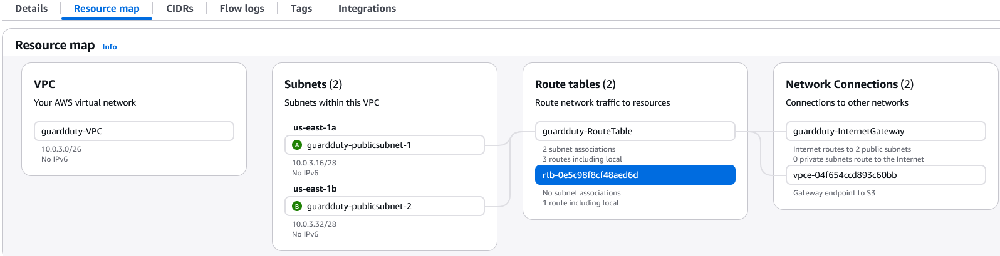
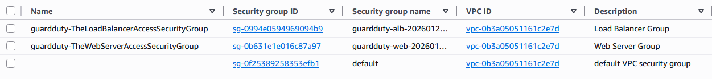
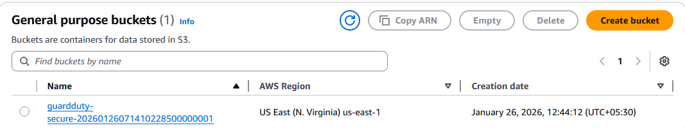
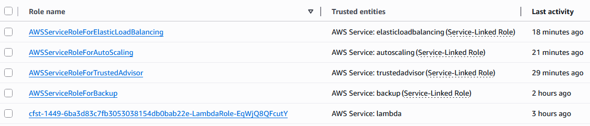
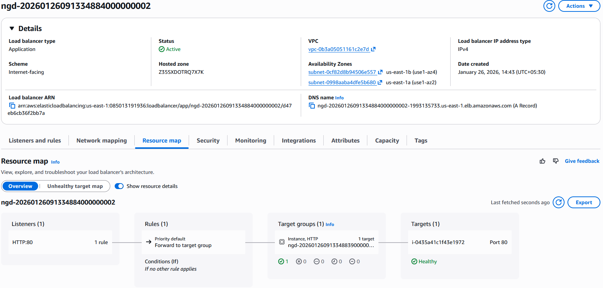
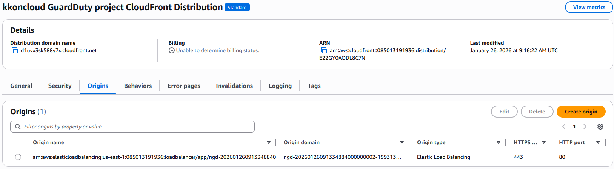
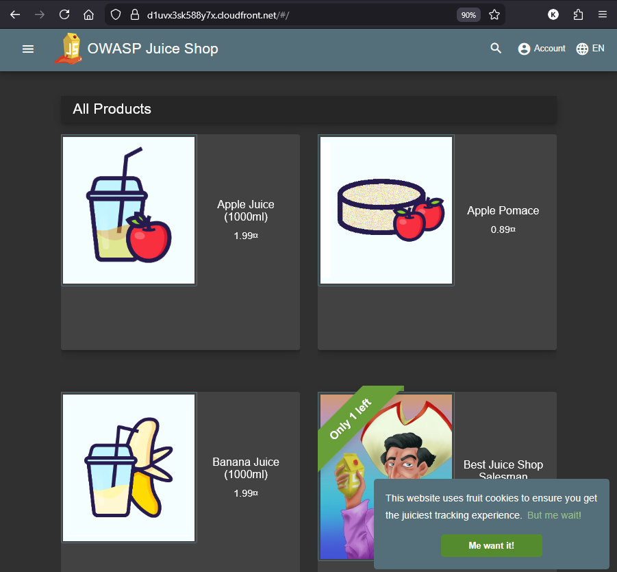

# Deploying Networking and Compute

**Note**: Since I'm building a few resources at a time, I will be applying Terraform in stages using `-target` to focus on specific parts of the config. This is not typical Terraform practice, but it helps me validate each piece as I go.

**Order of deployment:** Terraform, for the most part, can handle dependencies and resource creation order on its own. However, in this case, I want to ensure that foundational pieces like networking and security groups are in place before moving on to compute resources. It's best to deploy in the same order I am doing here based on the dependencies that I have planned in my project.

Also, since I am using AWS Lambda for auto-remediation, I have to run the below bash script to ready the python file zip before applying Terraform.

**Package the Lambda**:
```bash
❯ ./package-lambda.sh
Packaging Lambda function...
✓ Lambda function packaged: remediation_lambda.zip
You can now run: terraform apply
```


## 1. Networking: VPC + Public Subnets

We start with a simple VPC and a couple of public subnets. The idea is to make the app **intentionally exposed** so it’s easy to poke at.

Key pieces (from `vpc.tf`):

- A VPC with a configurable CIDR block.
- Two public subnets spread across availability zones.
- An Internet Gateway and a route table that sends `0.0.0.0/0` to the IGW.
- An S3 **VPC gateway endpoint** so our instances can talk to S3 without leaving AWS’s backbone.

#### Terraform deployment:

```bash
terraform apply -var-file=credentials.tfvars \
-target="aws_vpc.main" \
-target="aws_subnet.public_subnet[0]" \
-target="aws_subnet.public_subnet[1]" \
-target="aws_route_table.main" \
-target="aws_internet_gateway.main" \
-target="aws_route.internet" \
-target="aws_route_table_association.public_subnet[0]" \
-target="aws_route_table_association.public_subnet[1]" \
-target="aws_vpc_endpoint.s3"
```
\* _Make sure to select your credentials.tfvars file if using one._
#### Results:
VPC, Subnets, IGW, Route Table, and S3 Endpoint all up and running.

<kbd>  </kbd>


## 2. Security Groups: Letting the World In (On Purpose)

Security groups live in `security_groups.tf`. They’re configured to:

- Allow inbound HTTP/HTTPS to the ALB from the internet/CloudFront.
- Allow inbound traffic from the ALB to the web instances.
- Allow wide-open egress so outbound traffic is basically unrestricted.

#### Terraform deployment:

```bash
terraform apply -var-file=credentials.tfvars \
-target="aws_security_group.alb" \
-target="aws_security_group.web_server" \
-target="aws_security_group_rule.alb_egress_all" \
-target="aws_security_group_rule.alb_ingress_cloudfront" \
-target="aws_security_group_rule.web_server_egress_all" \
-target="aws_security_group_rule.web_server_ingress_alb"
```

#### Results:
Security groups created and rules applied.

<kbd>  </kbd>
_Again: not how you’d lock down prod—but perfect for a security lab._

---

## 3. S3 buckets
Before we get to compute, we need an S3 bucket to hold our vulnerable app code (OWASP Juice Shop). This is defined in `s3.tf`.
#### Terraform deployment:

```bash
terraform apply -var-file=credentials.tfvars \
-target="aws_s3_bucket.secure" \
-target="aws_s3_bucket_ownership_controls.secure" \
-target="aws_s3_bucket_policy.secure" \
-target="aws_s3_bucket_public_access_block.secure" \
-target="aws_s3_bucket_server_side_encryption_configuration.secure"
```
#### Results:
S3 bucket created with proper security controls.

<kbd>  </kbd>

## 4. The different IAM Roles
Next up are the IAM roles and policies in `iam.tf`. These include:
- An EC2 role with SSM and S3 access so we can manage instances and let them pull app code from S3.
- A Lambda execution role with permissions to perform GuardDuty remediation actions.

#### Terraform deployment:

```bash
terraform apply -var-file=credentials.tfvars \
-target="aws_iam_role.ec2_role" \
-target="aws_iam_instance_profile.ec2_profile" \
-target="aws_iam_role_policy_attachment.ec2_ssm_managed" \
-target="aws_iam_role_policy_attachments_exclusive.ec2_role" \
-target="aws_iam_role_policy.ec2_s3_policy" \
-target="aws_iam_role.lambda_remediation_role" \
-target="aws_iam_role_policy.lambda_remediation_policy"
```
#### Results:
IAM roles and policies created.
<kbd>  </kbd>

## 5 . The Vulnerable App: EC2 + ALB + CloudFront

The main part of this setup is OWASP Juice Shop running on EC2 instances in an Auto Scaling group. This could possibly much simpler with just a public EC2 instance or more complex using ECS/Fargate, but I'm going with an Auto-scaling group and CloudFront as the front door just to add a bit more AWS flavor.

#### EC2 & CloudFront Terraform deployment:

```bash
terraform apply -var-file=credentials.tfvars \
-target="aws_autoscaling_group.web" \
-target="aws_lb.main" \
-target="aws_lb_listener.http" \
-target="aws_lb_target_group.web" \
-target="aws_cloudfront_distribution.main"
```

#### Application Load Balancer
In `loadbalancer.tf`, we add an internet-facing ALB:

- Listens on HTTP.
- Routes traffic to the Auto Scaling group’s target group.
- Uses the ALB security group we saw earlier.

#### Results:
ALB and target EC2 instances up and running.

<kbd>  </kbd>


### CloudFront Front Door

`cloudfront.tf` puts CloudFront in front of the ALB as the public entry point:

- The ALB is configured as the origin.
- The default CloudFront certificate and domain are fine for our purposes.

Net result: you get a convenient CloudFront URL to hand to your “attacker.”

#### Results:
CloudFront distribution deployed with ALB as origin.

<kbd>  </kbd>

## 6. Accessing the WebApp
With everything deployed, you can now access the OWASP Juice Shop app via the CloudFront URL output by Terraform.

```bash
terraform output
alb_dns_name = "ngd-20260126091334884000000002-1993135733.us-east-1.elb.amazonaws.com"
ec2_role_arn = "arn:aws:iam::085013191936:role/guardduty-ec2-role-20260126085637760800000002"
juiceshop_url = "https://d1uvx3sk588y7x.cloudfront.net"
s3_vpc_endpoint_id = "vpce-04f654ccd893c60bb"
secure_bucket = "guardduty-secure-20260126071410228500000001"
```

<kbd>  </kbd>


### Next Steps
Now that the vulnerable app is up and running, we can move on to deploying GuardDuty and the automated remediation components in the next step of the lab. Head over to [STEP02.md](./STEP02.md) to continue.