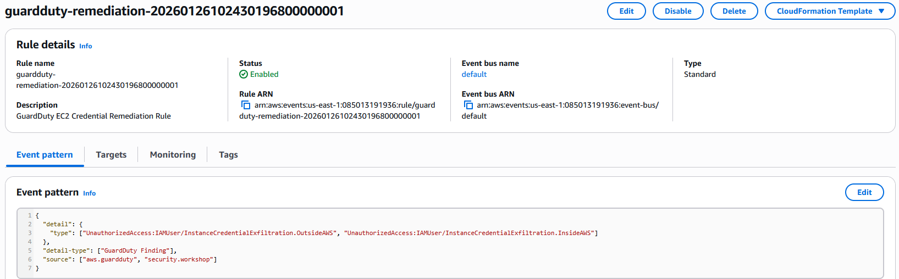
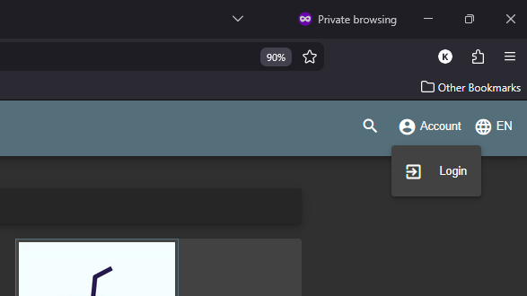
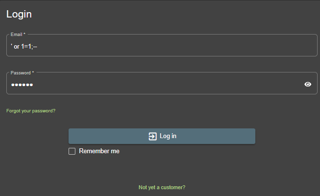
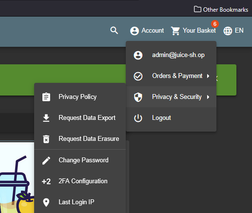
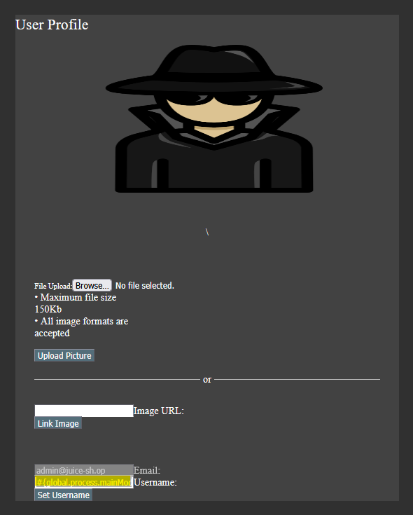
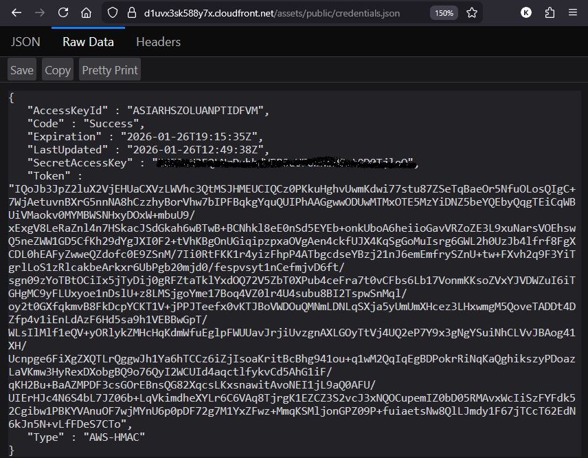
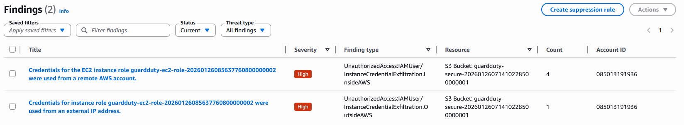
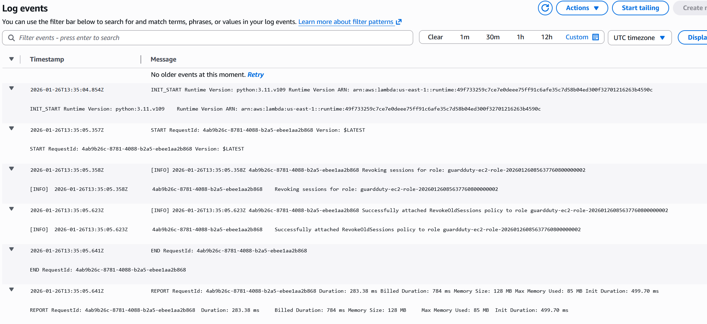
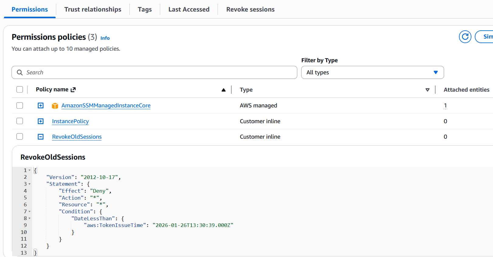

# The "Attack" and the remediation setup

The [OWASP Juice shop](https://github.com/juice-shop/juice-shop?tab=readme-ov-file#documentation) is a popular intentionally vulnerable web application used for security training. In this section, we will access the app, simulate attacks, setup GuardDuty and see how GuardDuty detects and remediates them.


## Deploying EventBridge (Clouwatch Events), Lambda and GuardDuty for Remediation
Before we can simulate attacks and see GuardDuty in action, we need to deploy the GuardDuty detector, EventBridge rule, and Lambda function that will perform the remediation. This is all defined in `guardduty.tf`, `eventbridge.tf`, and `lambda.tf`.

#### Terraform deployment:

```bash
terraform apply -var-file=credentials.tfvars \
-target="aws_cloudwatch_event_rule.guardduty_remediation" \
-target="aws_cloudwatch_event_target.remediation_lambda" \
-target="aws_guardduty_detector.main" \
-target="aws_lambda_function.remediation" \
-target="aws_lambda_permission.allow_eventbridge"
```
#### Results:

Eventbridge rules setup to listen for GuardDuty findings and trigger the remediation Lambda function.

<kbd>  </kbd>

---
Lambda function created for remediation, that is triggered by Eventbridge on GuardDuty findings with the appropriate permissions.

<kbd>  </kbd>

---

## SQL Injection to Exfiltrate Credentials

Now that we have the vulnerable app running and GuardDuty with remediation deployed, let's simulate an attack. We will perform a SQL Injection attack to exfiltrate credentials from the Juice Shop application.

This webapp has a lot of vulnerabilities, but for this lab, we will focus on the following explained in this [NextWork project](https://learn.nextwork.org/projects/aws-security-guardduty?track=high).

1. The website has a login button on the top right.

<kbd>  </kbd>

2. Log in to the Juice Shop application but using a simple SQL Injection payload in the username field to bypass authentication.'
    - Use the payload: `' OR '1'='1` in the username field and any password.

<kbd>  </kbd>

3. This will log you in as an admin user without needing a valid password.

<kbd>  </kbd>

4. Next, click on the admin username on the top right. In the admin account name, enter the javascript mentioned [NextWork project](https://learn.nextwork.org/projects/aws-security-guardduty?track=high).

<kbd>  </kbd>

5. This script will exfiltrate the credentials to a file that is publicly accessible json file. This can be accessed using the URL: `[JuiceShopURL]/assets/public/credentials.json`

<kbd>  </kbd>

6. Now, we will use these credentials to create a temporary AWS CLI profile named `stolen` and steal a file stored in S3. Use the instructions in the blog [NextWork project](https://learn.nextwork.org/projects/aws-security-guardduty?track=high) on how to do this.

  - As we can see below, we have successfully used the credentials from the role assigned to the EC2 instance.
```bash
> aws sts get-caller-identity --profile stolen
{
    "UserId": "AROARHSZOLUAH6H2I3DNM:i-0435a41c1f43e1972",
    "Account": "085013191936",
    "Arn": "arn:aws:sts::085013191936:assumed-role/guardduty-ec2-role-20260126085637760800000002/i-0435a41c1f43e1972"
}
```
  - Using this profile, we have downloaded the secret file from S3 bucket created as part of this lab.

```bash
❯ aws s3 cp s3://$JUICESHOPS3BUCKET/secret-information.txt . --profile stolen
download: s3://guardduty-secure-20260126071410228500000001/secret-information.txt to ./secret-information.txt

❯ ls | grep secret
secret-information.txt
```

7. From the GuardDuty console, we can now see that GuardDuty has detected this activity as a `InstanceCredentialExfiltration` finding. I attempted to access S3 using the EC2 instance role credentials outside of AWS from a personal laptop and also from another AWS account and we can see from the screenshot below that GuardDuty has detected both these activities.

<kbd>  </kbd>

8. From the Cloudwatch Logs console, we can see that the EventBridge rule has triggered the remediation Lambda function.

<kbd>  </kbd>

9. After the Lambda function has executed, we can see from the IAM console that a `RevokeOldSessions` Deny policy has been attached to the EC2 instance role, effectively revoking all compromised sessions. We can also see that we can't access the S3 bucket using the `stolen` profile anymore.

<kbd>  </kbd>

```bash
~ $ aws s3 cp s3://$JUICESHOPS3BUCKET/secret-information.txt . --profile stolen
fatal error: An error occurred (403) when calling the HeadObject operation: Forbidden
```

## Summary
In this lab, we deployed a vulnerable web application (OWASP Juice Shop) on AWS using Terraform. We then simulated a SQL Injection attack to exfiltrate credentials and access sensitive data in S3. GuardDuty detected the malicious activity and triggered an automated remediation process using EventBridge and Lambda, which revoked the compromised credentials, demonstrating the effectiveness of AWS security services in protecting cloud resources.

## Notifications for GuardDuty Findings
While automated remediation is crucial, it's also important to be notified of security findings in real-time. In the next step, we will set up an SNS topic and subscription to receive email notifications for GuardDuty findings.

We will look at one of the methods on how to do that in the next step: [Reporting GuardDuty Findings via email using SNS](STEP03.md)

*Note: The Guardduty findings and the email notitifications are not immediate and may take a few minutes to appear.*

## Cleanup
To avoid incurring ongoing costs, remember to destroy the Terraform-managed infrastructure once you are done with the lab:

```bash
terraform destroy -var-file="credentials.tfvars"
```