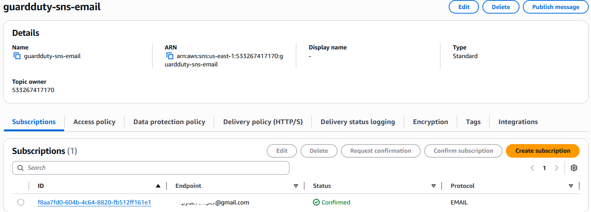
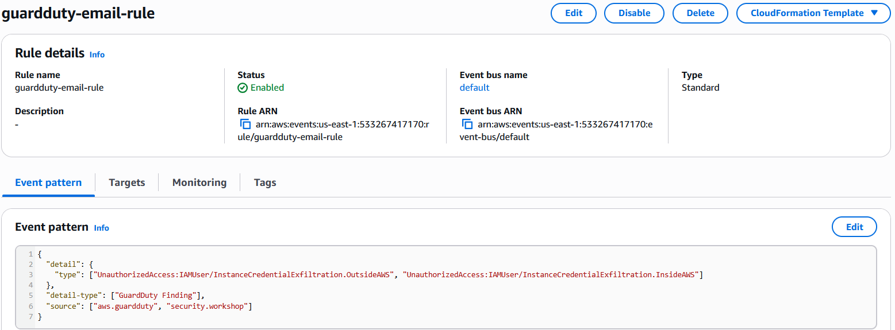
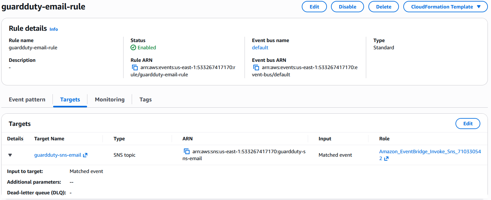
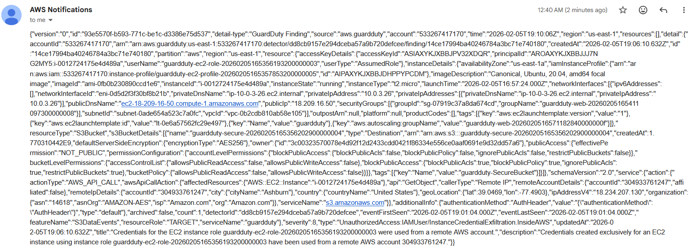
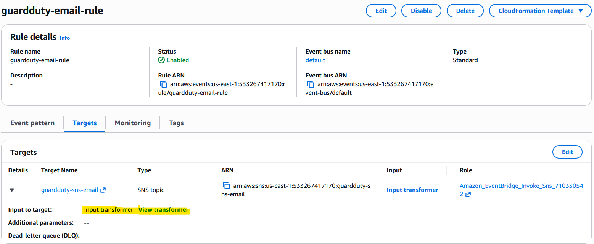
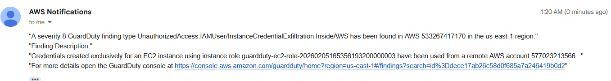

# Reporting GuardDuty Findings via email using SNS
We have configured Eventbridge to send a notification to AWS Lambda for auto-remediation for the attack. In this step, we will set up an SNS topic and subscription to receive email notifications for GuardDuty findings. This will allow us to be alerted whenever a new finding is generated by GuardDuty.

## Setting up SNS Topic and Subscription
1. Create an SNS topic named `guardduty-sns-email`.
2. Create an email subscription to the `guardduty-sns-email` topic using your email address.
3. Confirm the subscription by clicking the link sent to your email.

<kbd>  </kbd>

## Configuring Eventbridge to publish Guardduty findings to SNS

1. As part of our Terraform configuration in `eventbridge.tf`, we have already added an eventbridge rule that matches GuardDuty findings with event detail type `InstanceCredentialExfiltration.OutsideAWS` and `InstanceCredentialExfiltration.InsideAWS` and publishes them to AWS Lambda for auto-remediation.
2. We will create another eventbridge rule `guardduty-email-rule` that matches all GuardDuty findings with similar finding types and publishes them to the SNS topic `guardduty-sns-email` for email notifications.

<kbd>  </kbd>

<kbd>  </kbd>

3. Now we will trigger some GuardDuty findings by performing actions that would generate findings, similar to what we did in our lab. Once the findings are generated, you should receive email notifications for each finding that matches the event pattern defined in the eventbridge rule.

<kbd>  </kbd>

## Cleaning up the SNS email notification using Eventbridge Input Transformer

As we can see in the screenshot of the SNS email notification, the email contains a lot of details and is not formatted in a user-friendly way. In the next step, we will clean this up a bit by using "Input Transformer" in Eventbridge to extract only the relevant information from the GuardDuty finding and format it in a more readable way before sending it to SNS.

1. The "input transformer" configuration is available in the "Select targets" section of the eventbridge rule configuration. We will use the following configuration under the "input path" and "input template" sections to extract the severity, title, and description from the GuardDuty finding and format it in a more readable way:

#### Input Path
```json
{
"severity": "$.detail.severity",
"Account_ID": "$.detail.accountId",
"Finding_ID": "$.detail.id",
"Finding_Type": "$.detail.type",
"region": "$.region",
"Finding_description": "$.detail.description"
}
```
#### Input Template
```html
"A severity <severity> GuardDuty finding type <Finding_Type> has been found in AWS <Account_ID> in the <region> region."
"Finding Description:"
"<Finding_description>. "
"For more details open the GuardDuty console at https://console.aws.amazon.com/guardduty/home?region=<region>#/findings?search=id%3D<Finding_ID>"
```
2. After applying the input transformer configuration, we can see the input transformer configuration in the eventbridge rule configuration as shown below:

<kbd>  </kbd>

3. Now when we trigger some GuardDuty findings again, we should receive email notifications that are much cleaner and easier to read, containing only the relevant information about the finding.

<kbd>  </kbd>