# Newsletter Subscription Website project
This project, where I'm building a website with an included newsletter subscription feature, is intended to be inspired by many or most of the sites today that have a newsletter subscription option. I always used to think about how someone would design such a system and wanted to walk through my thought process while I built it. As I design and build the system, my imaginary customer adds to the requirements while I consider some best practices wherever possible.

## Table of Contents
- [Phase 1](#phase-1)
  - [Current requirement](#current-requirement)
  - [Solution](#solution)
  - [Phase 1 Resulting Architecture](#phase-1-resulting-architecture)
- [Phase 2](#phase-2)
  - [Current requirement](#current-requirement-1)
  - [Solution](#solution-1)
  - [Phase 2 Resulting Architecture](#phase-2-resulting-architecture)
- [Phase 3](#phase-3)
  - [Current requirement](#current-requirement-2)
  - [Solution](#solution-2)
  - [Phase 3 Resulting Architecture](#phase-3-resulting-architecture)

## Phase 1
### Current requirement:
Simple website for business that can support 15-20 visitors a day. No newsletter subscription functionality yet, though it's available on the site.

### Solution:
#### Simple HTML + javascript static website hosted on S3 static website
I created a simple static website using HTML, CSS, and JavaScript (available in the folder [website](website/)). I did this using AI since I'm not a web developer. In a S3 bucket configured for static website hosting, I have the following files:
  - `index.html`: The main webpage with a newsletter subscription form and javascript to handle form submission and validation.
  - `error.html`: A simple error page to display for any wrong domain or path.
  - `images/`: A directory containing images used on the website.

<a href="images/03_s3_site_content.png" target="_blank" rel="noopener noreferrer"><kbd> 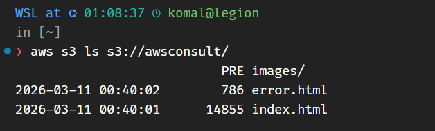 </kbd></a>

Once we have this setup, we can access the website using the S3 bucket's static website endpoint URL but, as we can see, the URL is not user-friendly and it's not secure since it's using HTTP.

<a href="images/04_access_s3site.png" target="_blank" rel="noopener noreferrer"><kbd> 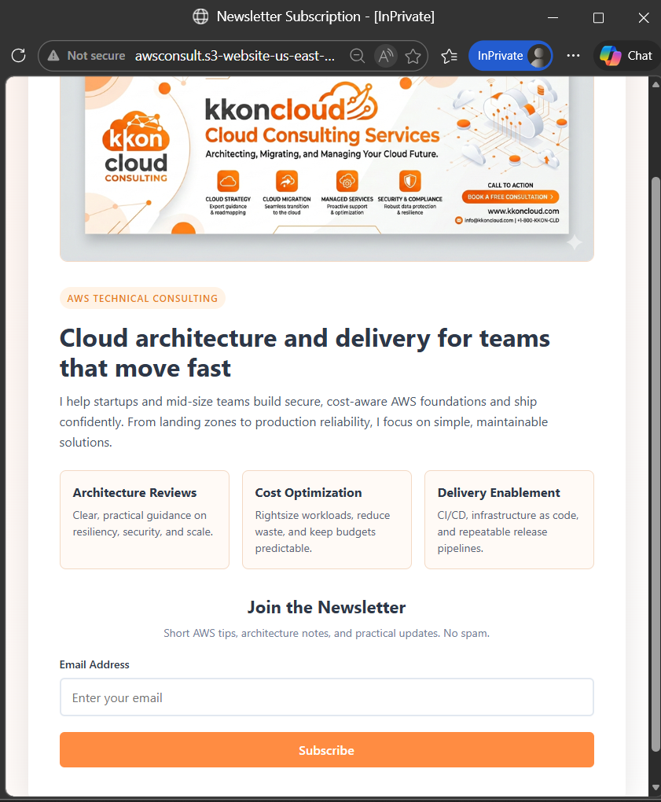 </kbd></a>

#### Phase 1 Resulting Architecture:
<a href="images/aa_http_only.png" target="_blank" rel="noopener noreferrer"><kbd> 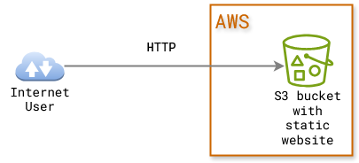 </kbd></a>

## Phase 2
### Current requirement:
Website access needs to be secure along with good performance in case of traffic from different parts of the world.

### Solution:
#### AWS Cloudfront for secure front end along with AWS Certificate Manager SSL certificate and custom domain name using Route53 Alias pointing to Cloudfront DNS name
To make our site secure and improve performance for global traffic, we can use CloudFront to serve the website over HTTPS. We can create a CloudFront distribution that points to the S3 bucket as the origin and configure it to use an SSL certificate from AWS Certificate Manager (ACM). This way, we can access the website securely using HTTPS.

- **SSL Certificate**: We can request a public SSL certificate from ACM for our domain (e.g., `awsconsult.kkoncloud.net`). This certificate will be used to enable HTTPS for our CloudFront distribution.

<a href="images/05_acm_ssl.png" target="_blank" rel="noopener noreferrer"><kbd> 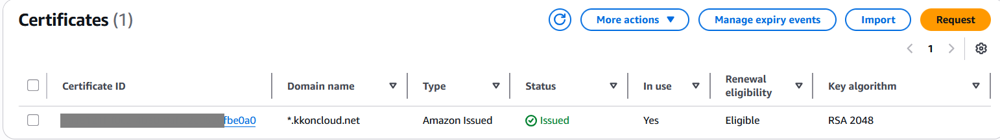 </kbd></a>


- **CloudFront Distribution**: We can create a CloudFront distribution that points to our S3 bucket website endpoint as the origin. We will configure the distribution to use the SSL certificate we obtained from ACM.. This will allow us to access the website securely using HTTPS.

<a href="images/06_cloudfront.png" target="_blank" rel="noopener noreferrer"><kbd> 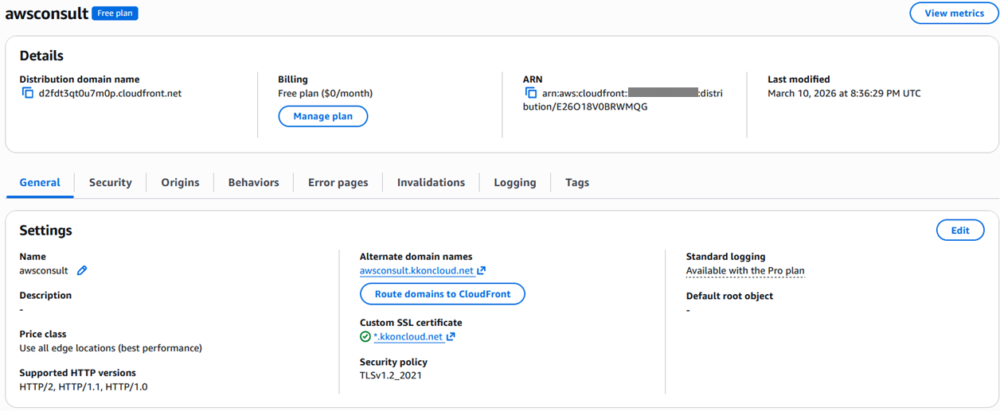 </kbd></a>

We also have HTTP to HTTPS redirection enabled in CloudFront, so if someone tries to access the website using HTTP, they will be automatically redirected to the HTTPS version of the site.

<a href="images/07_cloudfront_behaviour.png" target="_blank" rel="noopener noreferrer"><kbd> 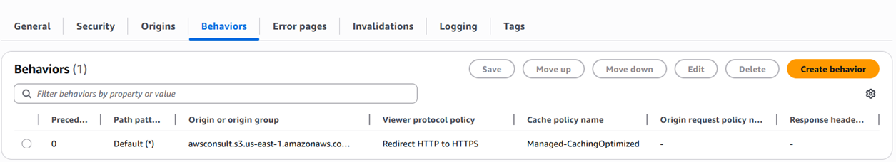 </kbd></a>

- **Custom Domain**: We can also configure a custom domain (e.g., `awsconsult.kkoncloud.net`) to point to our CloudFront distribution. This way, users can access the website using a more user-friendly URL. We can do this by creating a CNAME/ALIAS record in our DNS provider that points to the CloudFront distribution's domain name.

<a href="images/08_custom_domain.png" target="_blank" rel="noopener noreferrer"><kbd> 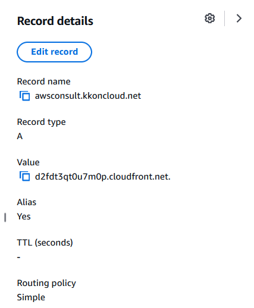 </kbd></a>

#### Phase 2 Resulting Architecture:
<a href="images/ab_cloudfront_acm.png" target="_blank" rel="noopener noreferrer"><kbd> 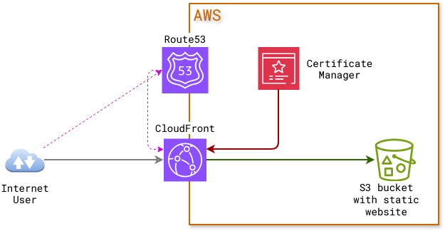 </kbd></a>

## Phase 3
### Current requirement:
Add functionality to handle newsletter subscription form submissions and store subscriber information in a database for later use.
### Solution:
#### AWS Lambda + API Gateway + DynamoDB + Simple Email Service (SES)
To handle newsletter subscription form submissions, we can create a backend using API Gateway,  AWS Lambda, and DynamoDB. The subscribe button on the webpage sends a POST message to API Gateway which in turn triggers a Lambda function. The Lambda function will validate the form data and then store the subscriber information in a DynamoDB table. It also sends a confirmation email to the subscriber using Amazon Simple Email Service (SES) that they have successfully subscribed to the newsletter.

_**Note**_: In our case, since we are not use production tier SES, we will not be able to send emails to unverified email addresses. So, we will just send the email to a pre-configured verified test email address for testing purposes.

- **API Gateway**: We can create a REST API using API Gateway that will serve as the endpoint for our newsletter subscription form. The API will have a POST method that will trigger the Lambda function when a user submits the form. The API Gateway will also need to handle CORS configuration to allow our frontend to communicate with the backend since they will be on different domains.

<a href="images/09_apigw_resource.png" target="_blank" rel="noopener noreferrer"><kbd> 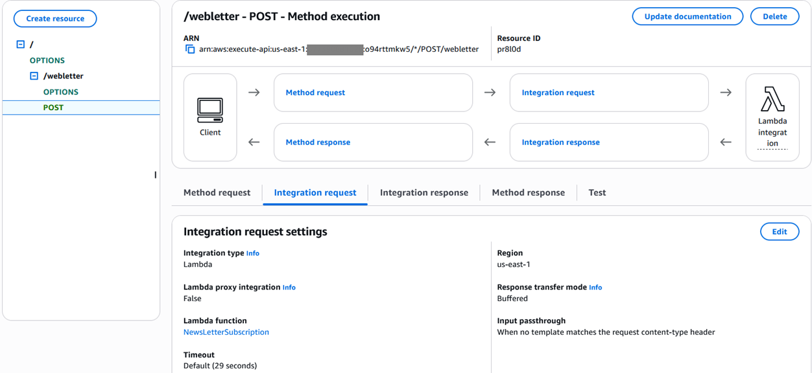 </kbd></a>
<a href="images/09_apigw_stage.png" target="_blank" rel="noopener noreferrer"><kbd> 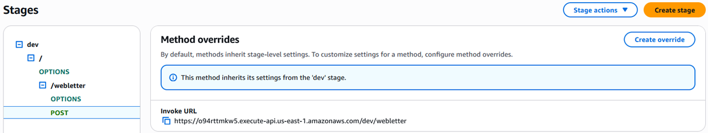 </kbd></a>

- **Lambda Function**: We need to create a Lambda function that will be triggered by the API Gateway when a user submits the newsletter subscription form. The Lambda function will validate the form data, store the subscriber information in a DynamoDB table, and send a confirmation email using SES. (Lambda script attached in this directory).

This Lambda function will need IAM permissions to write to the DynamoDB table, send emails using SES and write logs to Cloudwatch. The SAM template for this Lambda function is as below.

```yaml
# This AWS SAM template has been generated from your function's configuration. If
# your function has one or more triggers, note that the AWS resources associated
# with these triggers aren't fully specified in this template and include
# placeholder values. Open this template in AWS Infrastructure Composer or your
# favorite IDE and modify it to specify a serverless application with other AWS
# resources.
AWSTemplateFormatVersion: '2010-09-09'
Transform: AWS::Serverless-2016-10-31
Description: An AWS Serverless Application Model template describing your function.
Resources:
  NewsLetterSubscription:
    Type: AWS::Serverless::Function
    Properties:
      CodeUri: .
      Description: ''
      MemorySize: 128
      Timeout: 3
      Handler: lambda_function.lambda_handler
      Runtime: python3.14
      Architectures:
        - x86_64
      EphemeralStorage:
        Size: 512
      Environment:
        Variables:
          ALLOWED_ORIGIN: awsconsult.kkoncloud.net
          DYNAMODB_TABLE_NAME: newsletter-details
          SES_DESTINATION_EMAIL: yourexampleemail+rx@gmail.com
          SES_SOURCE_EMAIL: yourexampleemail@gmail.com
      EventInvokeConfig:
        MaximumEventAgeInSeconds: 21600
        MaximumRetryAttempts: 2
      PackageType: Zip
      Policies:
        - Statement:
            - Sid: VisualEditor0
              Effect: Allow
              Action:
                - ses:SendEmail
                - dynamodb:BatchGetItem
                - logs:CreateLogStream
                - dynamodb:BatchWriteItem
                - dynamodb:PutItem
                - dynamodb:DescribeTable
                - dynamodb:DeleteItem
                - ses:SendRawEmail
                - dynamodb:GetItem
                - dynamodb:Query
                - dynamodb:UpdateItem
                - logs:PutLogEvents
              Resource: '*'
      RecursiveLoop: Terminate
      SnapStart:
        ApplyOn: None
      Events:
        Api1:
          Type: Api
          Properties:
            Path: /webletter
            Method: POST
      RuntimeManagementConfig:
        UpdateRuntimeOn: Auto
```

- **DynamoDB**: We can create a DynamoDB table to store the subscriber information. The table will have a primary key (e.g., `email`) to uniquely identify each subscriber. Some details about the DynamoDB table used in this project are as below:

```yaml
 15:59:37  komal@ubuntu22vm
in [~]
❯ aws dynamodb describe-table \
  --table-name newsletter-details --output yaml \
  --query 'Table.{TableName:TableName, AttributeDefinitions:AttributeDefinitions, KeySchema:KeySchema, BillingModeSummary:BillingModeSummary, TableClassSummary:TableClassSummary}'
AttributeDefinitions:
- AttributeName: email
  AttributeType: S
BillingModeSummary:
  BillingMode: PAY_PER_REQUEST
  LastUpdateToPayPerRequestDateTime: '2026-03-13T14:31:25.877000+05:30'
KeySchema:
- AttributeName: email
  KeyType: HASH
TableClassSummary:
  TableClass: STANDARD
TableName: newsletter-details
```

- **SES**: We can use Amazon Simple Email Service (SES) to send a confirmation email to the subscriber after they have successfully subscribed to the newsletter. I have added two verified email addresses in SES, one for the source email (sender) and another for the destination email (receiver). In a production environment, you would typically want to send the confirmation email to the subscriber's email address, but since we are in the SES sandbox, we will just send it to a verified email address for testing purposes.

<a href="images/10_ses_emails.png" target="_blank" rel="noopener noreferrer"><kbd> 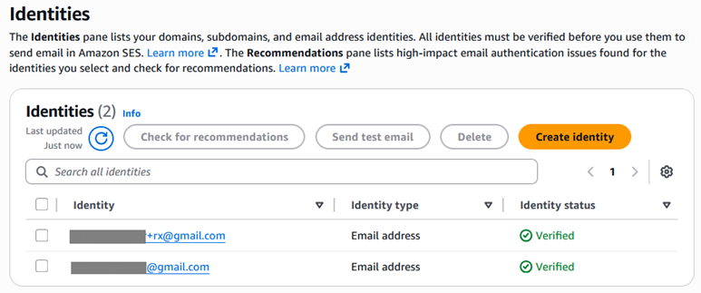 </kbd></a>

#### Phase 3 Resulting Architecture:
<a href="images/ac_phase3_arch.png" target="_blank" rel="noopener noreferrer"><kbd> 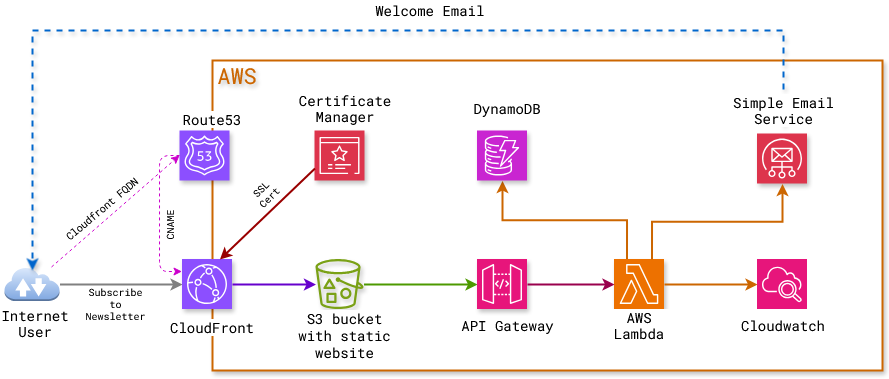 </kbd></a>

## Next Steps
The testing of how all this stuff works together is documented in [TESTING.md](TESTING.md) in this directory.