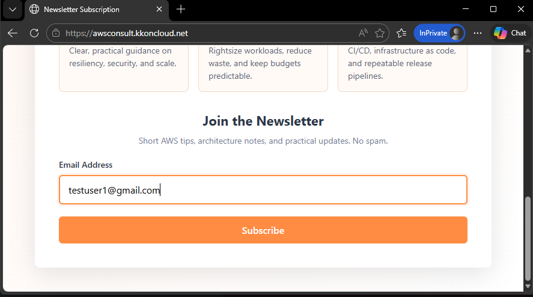
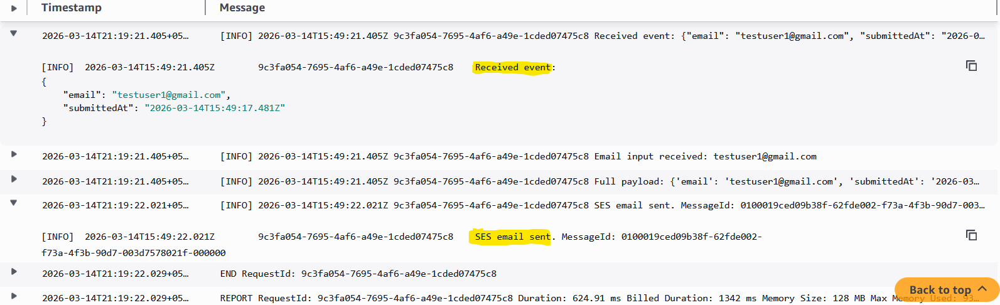
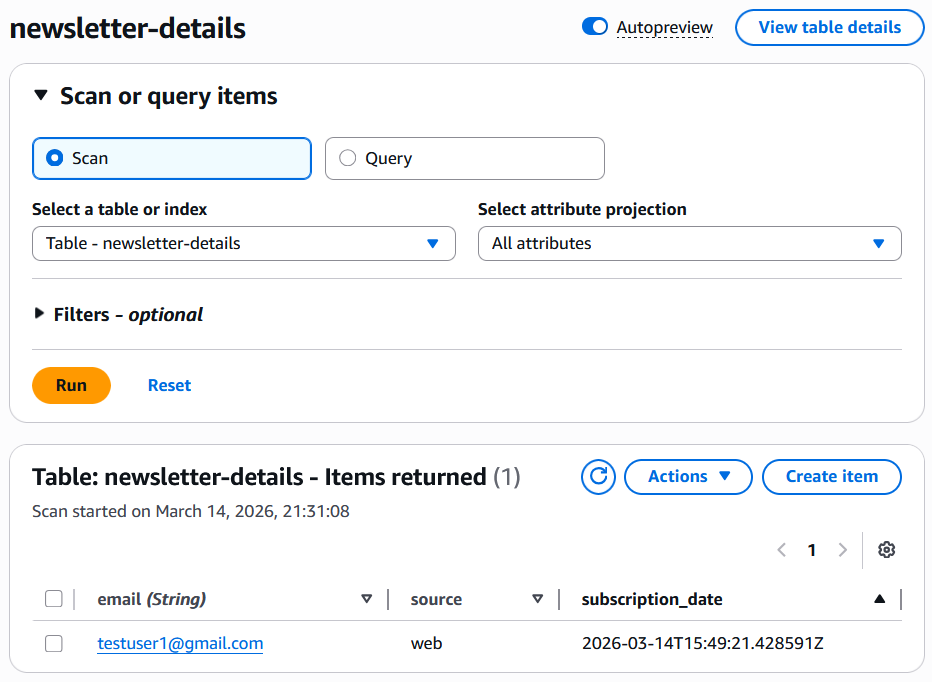
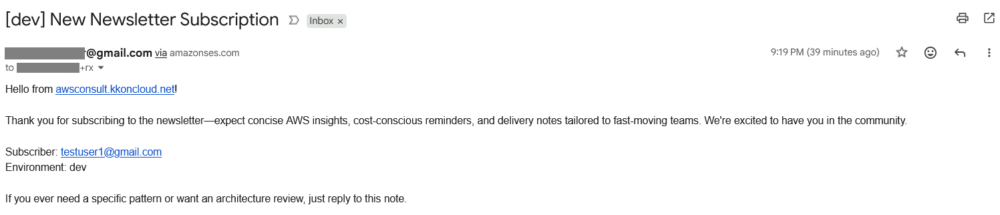

Now that we have built the whole setup as explained in [README.md](README.md) Let's see how this entire system work together.

1. User visits the newsletter page and submits their email address.

<a href="images/11_subscribe.png" target="_blank" rel="noopener noreferrer"><kbd>  </kbd></a>

2. The frontend makes a POST request to the API Gateway endpoint, which triggers the Lambda function.

3. The Lambda function performs the following actions:

- **Processes the request and logs the details in CloudWatch.**

<a href="images/12_lambda_logs.png" target="_blank" rel="noopener noreferrer"><kbd>  </kbd></a>

---

- **Stores the subscriber email in DynamoDB**

<a href="images/13_dynamodb_entry.png" target="_blank" rel="noopener noreferrer"><kbd>  </kbd></a>

---

- **Sends a notification email via SES**

<a href="images/14_ses_email.png" target="_blank" rel="noopener noreferrer"><kbd>  </kbd></a>
